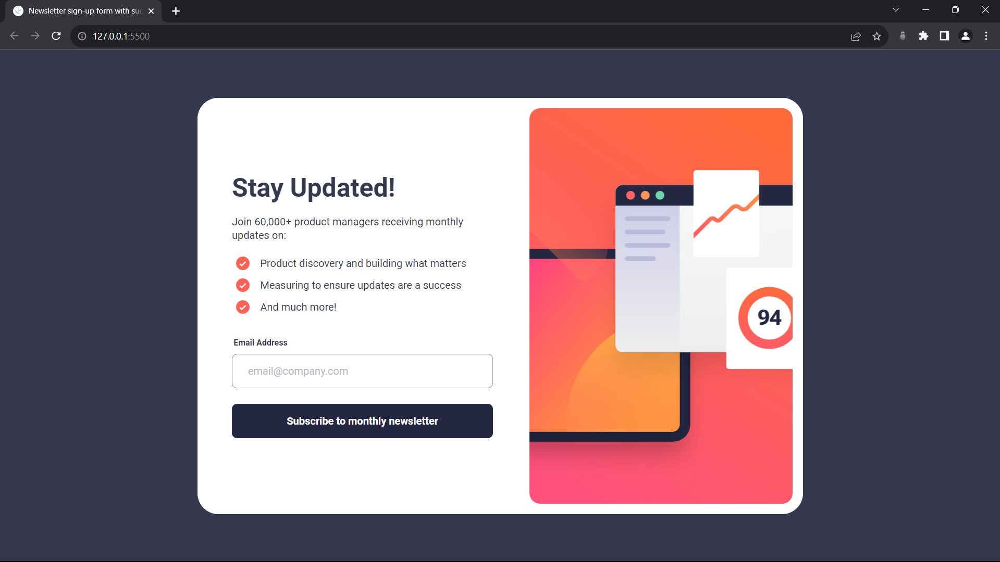

# Frontend Mentor - Newsletter sign-up form with success message solution

This is a solution to the [Newsletter sign-up form with success message challenge on Frontend Mentor](https://www.frontendmentor.io/challenges/newsletter-signup-form-with-success-message-3FC1AZbNrv).

## Table of contents

- [Overview](#overview)
  - [Screenshot](#screenshot)
  - [Links](#links)
- [My process](#my-process)
  - [Built with](#built-with)
  - [What I learned](#what-i-learned)
  - [Continued development](#continued-development)
  - [Useful resources](#useful-resources)
- [Author](#author)

## Overview

### The challenge

Users should be able to:

- Add their email and submit the form
- See a success message with their email after successfully submitting the form
- See form validation messages if:
  - The field is left empty
  - The email address is not formatted correctly
- View the optimal layout for the interface depending on their device's screen size
- See hover and focus states for all interactive elements on the page

### Screenshot

### Links

- Solution URL: [Link](https://github.com/TJ-Shubham/newsletter-sign-up-with-success-message)
- Live Site URL: [Link](https://tj-shubham.github.io/newsletter-sign-up-with-success-message/)

## My process

### Built with

- Semantic HTML5 markup
- CSS custom properties
- Flexbox
- Mobile-first workflow
- Used media query
- Dom Manipulation
- react-vite
- tailwind css

### What I learned

Learn about form validation. Try a mobile-first solution for the first time.

### Continued development

To gain in-depth knowledge about form validation.

### Useful resources

- [form-validation](https://developer.mozilla.org/en-US/docs/Web/API/ValidityState) - This helped me to understand form validation concept.

## Author

- Frontend Mentor - [TJ-Shubham](https://www.frontendmentor.io/profile/TJ-Shubham)
